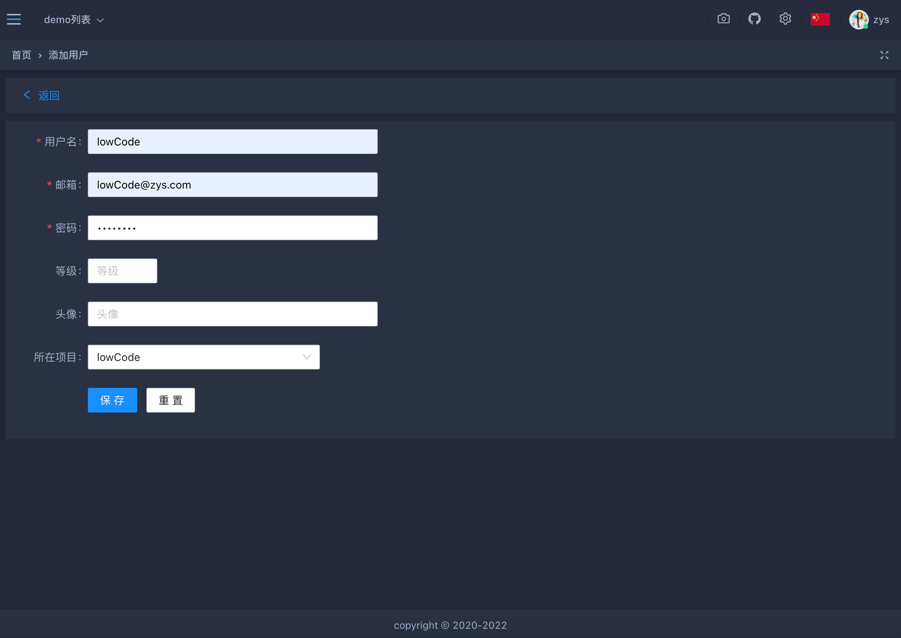
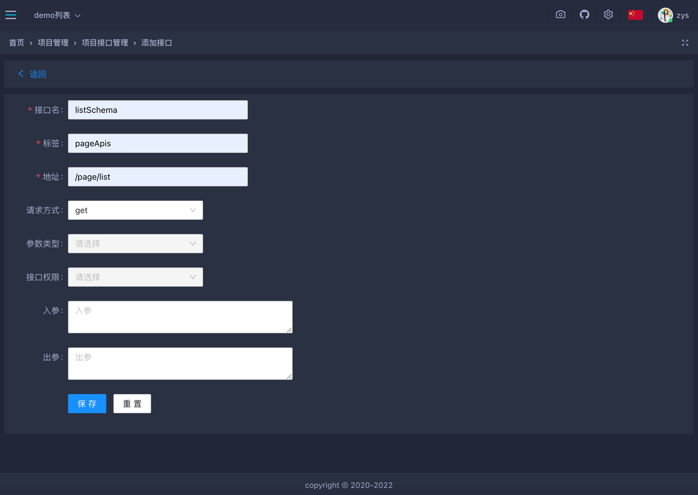
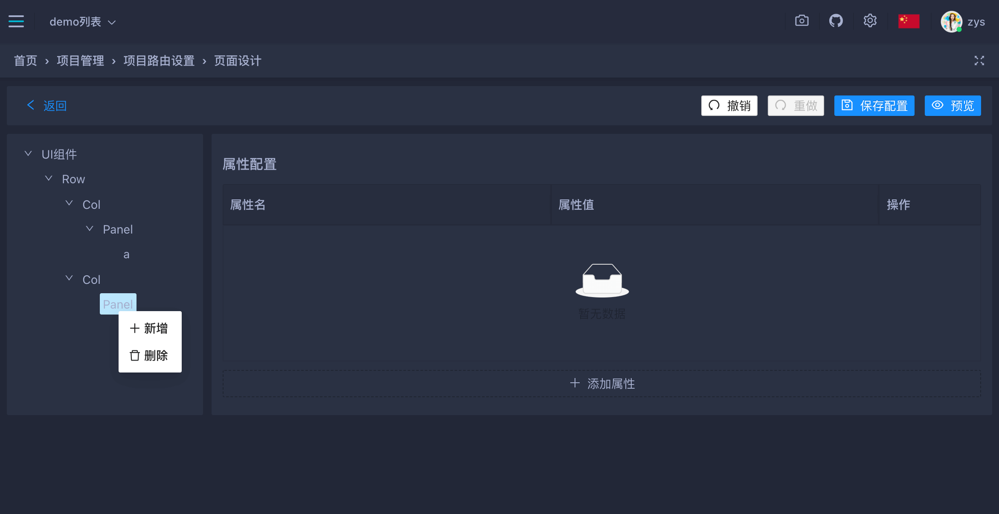
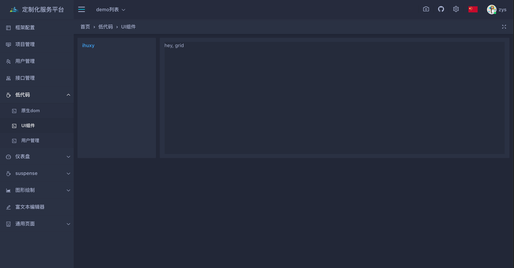
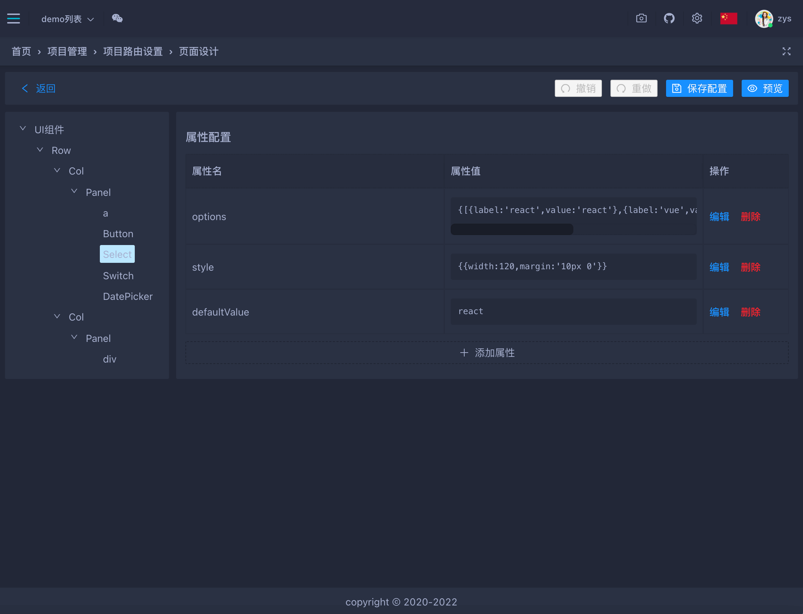
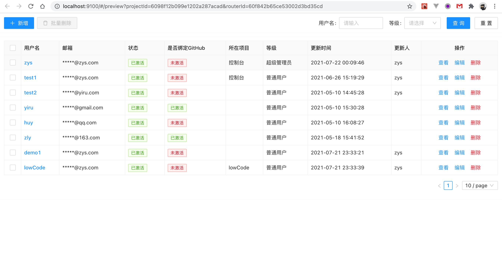
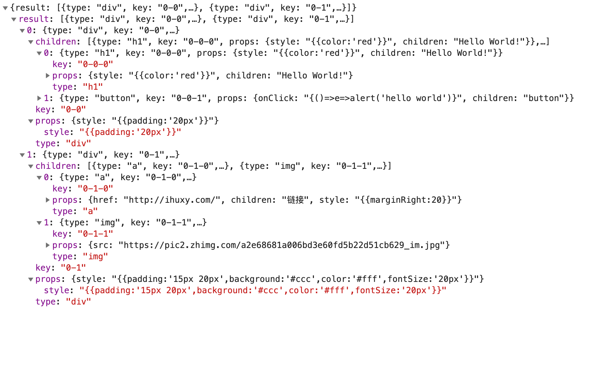
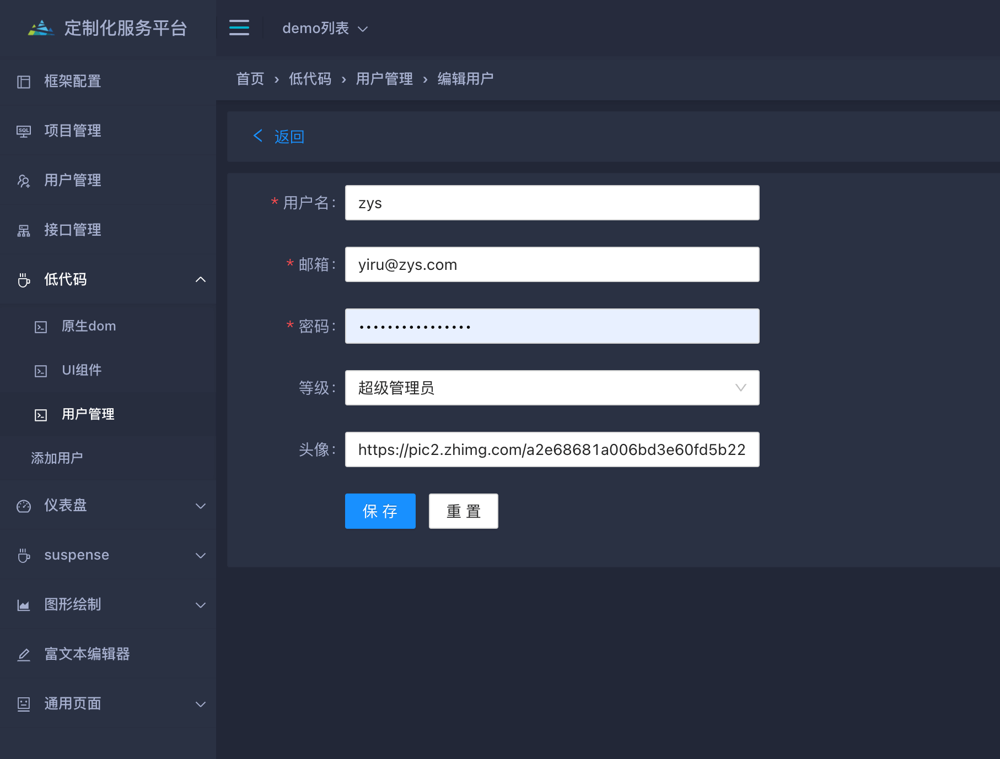
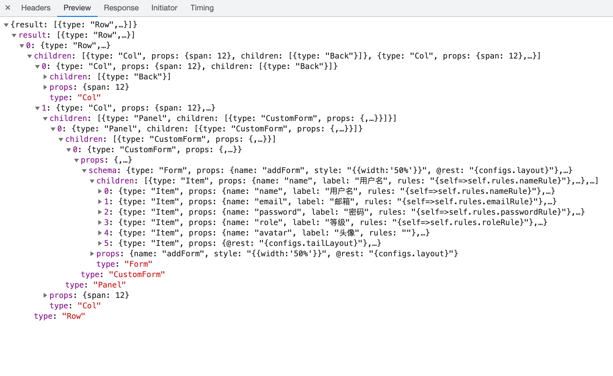

## 低代码（low-code）简单实践

[](https://github.com/ahyiru/ihuxy/blob/develop/LICENSE)
[](https://www.npmjs.com/package/@huxy/router)
[](https://github.com/ahyiru/web-design/actions/workflows/lint-ci.yml)
[](http://ihuxy.com/)


Web Design 是一个简单的低代码开发平台，用于快速搭建项目、开发页面、配置接口等。

Web Design 使用可视化操作生成页面描述 `json schema`，然后通过自定义规则将 `json schema` 渲染成目标页面来实现页面可视化开发。

Web Design 基于 [huxy-admin](https://github.com/ahyiru/huxy-admin) 模板创建。除了提供页面可视化搭建，还包含了工程化配置、主题设计、Layout 设计、API 配置、权限和 i18n 配置等。

### 详细功能介绍：[系统功能](https://github.com/ahyiru/huxy-admin/blob/develop/doc/functions.md)


### 理解

低代码就是尽量**少写代码**，定义好业务组件，通过可视化操作实现开发工作。它主要受众是开发者。

无代码（no-code）即不需要写代码就能完成开发，更加偏向业务层的定制。

### 解决了什么？

> 提效降本、质量保障、降低开发门槛。

低代码可以提升开发效率，保障系统稳定性，也降低了开发门槛，可以直接可视化开发。

### 可能存在的问题

- 不灵活。适用于通用业务领域，对定制化需求不友好。
- 不可控。业务拓展性、可维护性较低。
- 不好用。开发不想用，业务不会用。

低代码或许可以降低开发门槛，但复杂度并不会降低。可视化开发的自由度越高，组件粒度就越细，配置复杂度就越高。

## 简单实践

前端低代码开发不仅是界面开发，应该还包含工程化、项目管理、api 接口、权限控制等一些列的开发提效。

### 设计

一个页面其实就是一棵树，所以不管是拖拽还是配置，最终完成的就是一棵数据树。所以我们可以通过`json schema`来进行页面设计。

### 实现

#### 基础搭建

[工程化](https://mp.weixin.qq.com/s?__biz=MzAwOTI3MTk3Nw==&mid=2455985991&idx=1&sn=f1ee35b789a052518a9d2ade54134497&chksm=8cf5d081bb825997f7570355d36a7f6e0b24f56d8613e1a2174c9800c8709b41bf4e8c31ae58&=300862977&=zh_CN#rd)、[layout 设计](https://mp.weixin.qq.com/s?__biz=MzAwOTI3MTk3Nw==&mid=2455985961&idx=1&sn=bc656fc27eea4fc204903d87e70215ff&chksm=8cf5d0efbb8259f9780c0ca630bc668843c6fed262395e8a8fc76c4559de40e5d212b73e6806&=300862977&=zh_CN#rd)、[权限和 i18n](https://mp.weixin.qq.com/s?__biz=MzAwOTI3MTk3Nw==&mid=2455986033&idx=1&sn=1f5bc749f32df0e0cc84b08125a4bc32&chksm=8cf5d0b7bb8259a18b1843e3c2693e72cfb40ff35c40707e32bf653e6e11ca1d6ae812c6cbcc&=300862977&=zh_CN#rd)、[API 管理](https://mp.weixin.qq.com/s?__biz=MzAwOTI3MTk3Nw==&mid=2455986140&idx=1&sn=50b43b26a16abd10adf466a735a6da41&chksm=8cf5d01abb82590c557cd3a80f6c5adb41194a7a501ae238bd39b28dcfe1319b9ad0fbc9ce4c&=300862977&=zh_CN#rd) 这些都是一些管理平台的基础设施，前面也讲过，大家可以去看看。

### 页面设计

#### schema 设计

```javascript
const schema = {
  type: 'a',
  props: {},
  children: [],
};
```

- type：标签名或组件名。组件可以是 UI 组件或业务组件，先注册再使用。
- props：属性配置。组件的属性可根据组件库或自定义组件使用文档去配置。如果属性里面含有组件，可依照 schema 渲染原则执行。
- children：子节点。可以是文本节点，组件，或子元素列表。

#### custom render

```javascript
const render = (schema, params) => {
  schema = Array.isArray(schema) ? schema : [schema];
  const dom = schema.map((item, i) => {
    let {type, props, children} = item;
    type = (type || 'div').trim();
    const first = type.charAt(0);
    type = first.toUpperCase() === first ? components[type] || 'div' : type;
    props = {
      key: i,
      ...formatProps(props, params),
    };
    children = Array.isArray(children) ? render(children, params) : [formatChildren(children || props.children, params) ?? null];
    return createElement(type, props, ...children);
  });
  return dom;
};
```

- components：我们注册的组件。
- formatProps、formatChildren：将 props 或 children 转换为我们需要的运行时的值。主要用于我们自定义的组件。props 或 children 可以是函数，可以传递我们需要的参数 params，最终返回我们需要的数据。
- render：通过 react 的 `createElement(type,props,...children)` 渲染。

**_属性解析_**

```javascript
const render = (schema, params) => {
  schema = Array.isArray(schema) ? schema : [schema];
  const dom = schema.map((item, i) => {
    let {type, props, children} = item;
    type = (type || 'div').trim();
    const first = type.charAt(0);
    type = first.toUpperCase() === first ? components[type] || 'div' : type;
    props = {
      key: i,
      ...formatProps(props, params),
    };
    children = Array.isArray(children) ? render(children, params) : [formatChildren(children || props.children, params) ?? null];
    return createElement(type, props, ...children);
  });
  return dom;
};
```

可使用自定义函数，组件内部数据作为参数，来获取属性值。或直接使用全局 configs。

例如：

```javascript
{
  prop:'test',
  isPending:`{true}`,
  style:`{{width:'800px'}}`,
  handle:`{self=>self.rules}`,
  onClick:`{()=>e=>alert('hello')}`,
}

```

通过 `{code}` 将 code 字符串转换为运行时代码。

**_判断并提取字符串代码_**

```javascript
const matchedStr = (str, c = ['{', '}']) => str?.trim?.().match(new RegExp(`^${c[0]}([\\s\\S]*)${c[1]}$`))?.[1];
```

**_执行字符串代码_**

```javascript
const str2code = (str, hasReturn = false) => {
  str = hasReturn ? str : `return ${str};`;
  const exec = Function(str);
  return exec();
};
```

> str2code 会直接执行并返回结果，如果返回的是函数会执行函数并返回结果。如果我们需要返回函数，就要包裹一层函数。例如：`onClick`，`{()=>e=>alert('hello')}`。

**_路由设置_**

路由配置可直接在页面配置，存入后台，使用时获取路由配置即可。

```javascript
{
  path:'/low-code',
  name:'低代码',
  icon:'CoffeeOutlined',
  denied:false,
  children:[
    {
      path:'/dom',
      name:'原生dom',
      icon:'CodeOutlined',
      componentPath:'/lowCode',
      loadData:{
        pageSchema,
      },
    },
    {
      path:'/ui',
      name:'UI组件',
      icon:'CodeOutlined',
      componentPath:'/lowCode',
      loadData:{
        pageSchema,
      },
    },
    {
      path:'/users',
      name:'业务组件',
      icon:'CodeOutlined',
      componentPath:'/lowCode',
      loadData:{
        pageSchema,
      },
    },
    {
      path:'/users/add',
      name:'新增用户',
      componentPath:'/lowCode',
      loadData:{
        pageSchema,
      },
    },
    {
      path:'/users/edit/:id',
      name:'编辑用户',
      componentPath:'/lowCode',
      loadData:{
        pageSchema,
      },
    },
  ],
}

```

如果整个系统都是通过 `schema` 数据配置生成的，那么我们只需一个渲染器，通过路由 id 获取到 `shcema` 数据，然后渲染成当前路由页面。所以只需一个渲染文件即可。

**_根据 `projectId`、`routerId` 获取路由页面数据。_**

```javascript
const pageSchema = async ({id}) => {
  const {result} = await apiList.listSchemaFn({routerId: id, projectId: defProject.id});
  return {result};
};
```

通过设置路由 `loadData` 来提前请求数据，页面直接获取即可。详细使用见 [useRouter](https://mp.weixin.qq.com/s?__biz=MzAwOTI3MTk3Nw==&mid=2455986102&idx=1&sn=4328f6e2d4d3077d7aac4962dbbaa736&chksm=8cf5d070bb8259661c6782d0235e12afce48fe6ce6d63139066a2d264feba61ee3769b32a66b&=300862977&=zh_CN#rd)

```javascript
const pageSchema = async ({id}) => {
  const {result} = await apiList.listSchemaFn({routerId: id, projectId: defProject.id});
  return {result};
};
```

**_页面渲染_**

```javascript
const Index = props => {
  const {pageSchema} = props;
  if (pageSchema == null || pageSchema.pending) {
    return <Spinner global />;
  }
  return customRender(pageSchema.result || [], {}, props);
};
```

### 可视化开发示例

#### 创建项目


首先我们创建一个项目，如图所示。本示例使用 `控制台` 项目演示。


#### 创建用户并分配项目



#### 创建 API




#### 新建项目路由


#### 为用户设置路由权限


### 页面设计

#### 原生 html 标签


根据 dom 元素属性自行配置。

#### UI 组件





当我们设计好页面时，可以随时回到项目路由查看改页面，也可点击预览查看，符合预期效果后保存即可。




原生标签和基础组件只能设计出一些静态展示效果，我们可以自定义一些业务组件，给页面加入交互性。

#### 业务组件

以 `table` 和 `form` 为例，简单设计一个用户管理页面。


为 `table` 设置了自定义属性 `actions `、`columns `、`searchSchema `、`modalSchema `

```javascript
{
  actions,
  columns,
  searchSchema,
  modalSchema,
}

```

- actions：定义事件
- columns：表头设计
- searchSchema：搜索表单
- modalSchema：弹窗表单


事件定义可自行定义 `action name` ，共页面使用，`apiName` 从我们 API 系统里面选。

**_预览_**



可实时进行页面预览，也提供了撤销重做操作。

#### 编辑功能

**_props 编辑_**

```javascript
const editProps = values => {
  const tree = editNodes(schemaTree, selectedKey, {props: values}, 'key');
  setSchema(tree);
  record(clone(tree));
  setDisableUndo(false);
};
```

每次编辑都会触发 `schema` 更新，并会记录每次操作的数据，使用 `record` 函数记录，便于我们完成撤销重做功能。

**_cacheData 函数_**

```javascript
const {record, undo, redo, clean} = cacheData();
```

**_撤销重做_**

```javascript
const undoDesign = () => {
  const {index, data} = undo();
  setSchema(data);
  if (index === 0) {
    setDisableUndo(true);
  }
  setDisableRedo(false);
};

const redoDesign = () => {
  const {index, length, data} = redo();
  setSchema(data);
  if (index === length - 1) {
    setDisableRedo(true);
  }
  setDisableUndo(false);
};
```

**_组件移动_**

提供了组件移动功能，可根据需要自行拖动。


```javascript
const onDrop = info => {
  const fromId = info.dragNode.key;
  const toId = info.node.key;
  const dropPosition = info.dropPosition;
  const tree = moveNodes(schemaTree, fromId, toId, dropPosition, 'key');
  setSchema(tree);
};
```

#### 效果

可点击按钮或链接查看效果。


页面 `schema` ：



**_用户管理页面_**


页面 `schema`：


编辑页面



页面 `schema`：



### 总结

低代码更多的是用来当作提升开发效率的一个工具，在我们当前业务范围内，写少量代码封装好业务组件，即可进行可视化开发。

平台的通用性和灵活性，需要我们在实际业务中去权衡。

我们需要认清，没有一劳永逸的方法，只有在不断探索中提升。

项目地址：[https://github.com/ahyiru/web-design](https://github.com/ahyiru/web-design)
