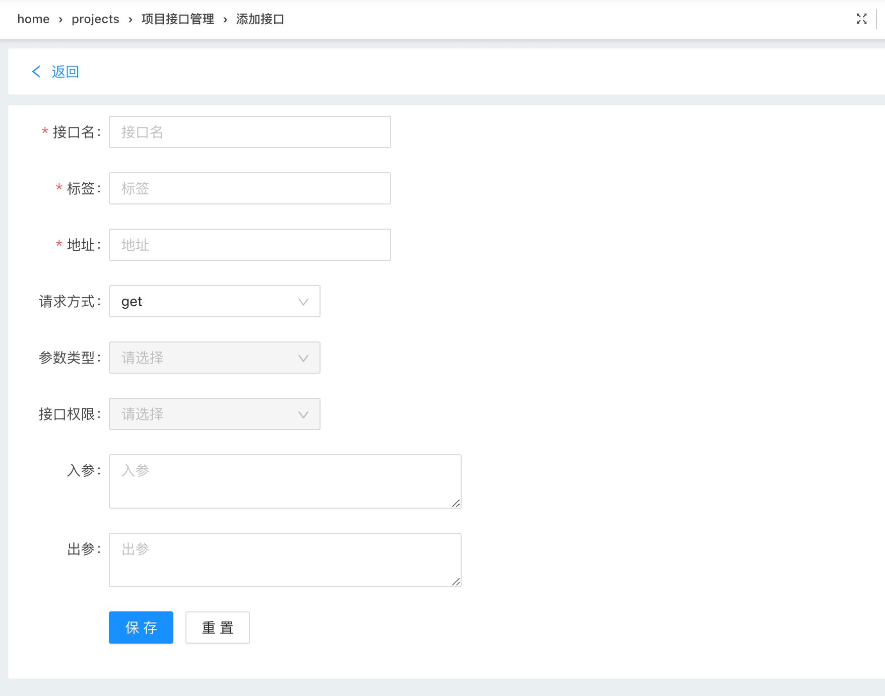
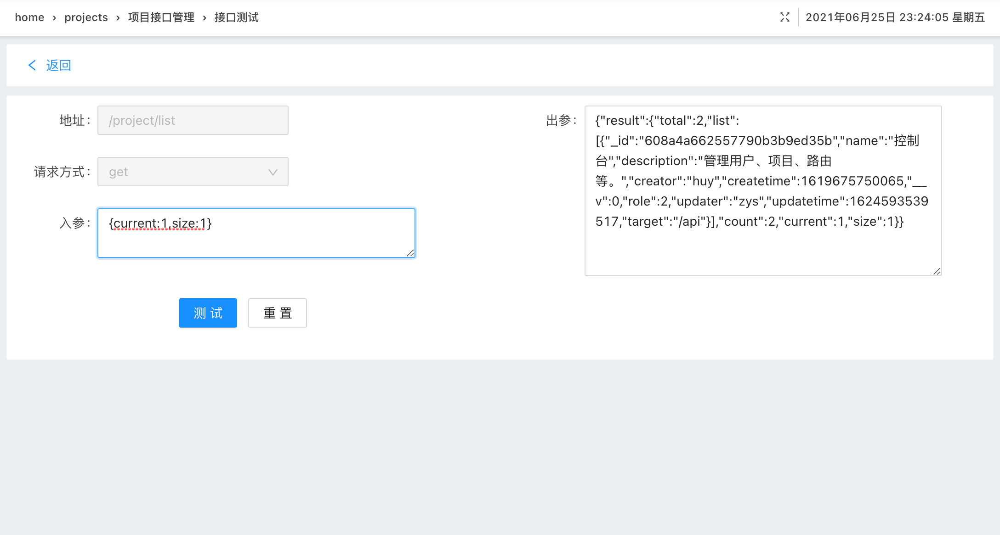

## API接口系统

将API接口放服务端，使用时直接从服务器获取即可。前后端也只需维护一份接口，方便维护更新。

### 接口设计

一般我们需要的接口信息有：

- url-地址
- method-请求方法
- params-参数
- type-参数类型

```javascript
const schemas={
  projectId: { type: String, required: true },
  url: { type: String, required: true },
  method: { type: String, required: true },
  tags: { type: String, required: true },
  name: { type: String, required: true },
  type: { type: String },
  auth: { type: String },
  input:{},
  output:{},
  description:{type:String},
};

```


### 前端接口函数

```javascript
const apiList={};

const getApiFn=async ()=>{
  const apis=await getList();
  apis.map(api=>{
    const {name,type,...rest}=api;
    const funcName=`${name}Fn`;
    const paramsKey=type||(rest.method==='post'?'data':'params');
    apiList[funcName]=data=>fetcher({...rest,[paramsKey]:data});
  });
  return apiList;
};

```

使用：

```javascript
import apiList from '@app/utils/getApis';

try{
  const {code,token,message:msg}=await apiList.loginFn(values);
  if(code===200){
    message.success(msg);
    storage.set('token',token);
    props.router.push('/');
  }
}catch(err){}

```

### 后台接口服务

获取apis配置信息。

```javascript
const getConfigs=app=>{
  app.get('/api/list',(req,res)=>{
    listApi(db,req,res);
  });
  return queryList(db,{current:1,size:1000},'url');
};

```
启动接口服务。

```javascript
const start=app=>{
  const getApis= getConfigs(app);
  getApis.then(result=>{
    const apis=classifyArr(result.list,'tags');
    Object.keys(apis).map(tag=>{
      fnList[tag](app,apis[tag]);
    });
  }).catch(error=>{
    console.log(error);
  });
};

```
### 获取接口信息

**添加/编辑接口**



我们的接口是基于项目来设计的，所以我们需要根据项目id来获取接口信息。

```javascript
import fetcher from './fetcher';
import {projectId} from '@app/configs/projects';
const getApis=()=>fetcher({url:'/api/list',params:{projectId,current:1,size:1000}});

```

我们可以为用户设置不同的项目，获取的接口信息也会不同。方便我们切换和维护。


### 接口测试


**页面上测试接口。可自行配置代理，设置token。**

```javascript
const testFn = async values => {
  try{
    const input=strToJson(values.input||'{}');
    const {url,method,type}=state;
    const paramsKey=type||method==='post'?'data':'params';
    const result=await testFetcher({url,method,[paramsKey]:input});
    form.setFieldsValue({
      output:JSON.stringify(result),
    });
  }catch(err){
    form.setFieldsValue({
      output:err,
    });
  }
};

```


### 使用示例

**前端添加接口**


**服务端接口**

```javascript
const testApi=(db,req,res)=>{
  /* db.find((error,result)=>{
    if(error){
      return res.status(res.statusCode).send({error});
    }
    return res.status(200).send({result});
  }); */
  return res.status(200).send({
    result:{
      total:2,
      list:[{name:'test1'},{name:'test2'}],
      current:1,
      size:10,
    },
  });
};

module.exports={
  testApi,
};

```

**测试**


[测试地址](http://ihuxy.com/apis)