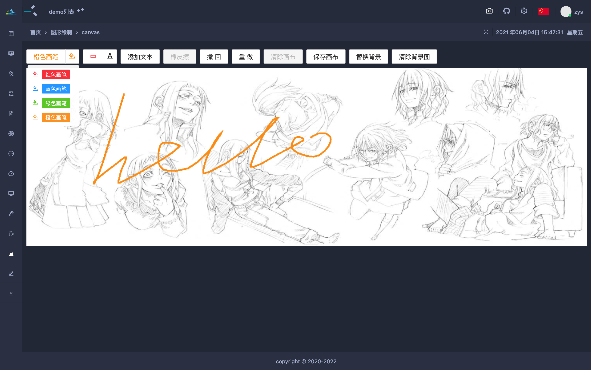
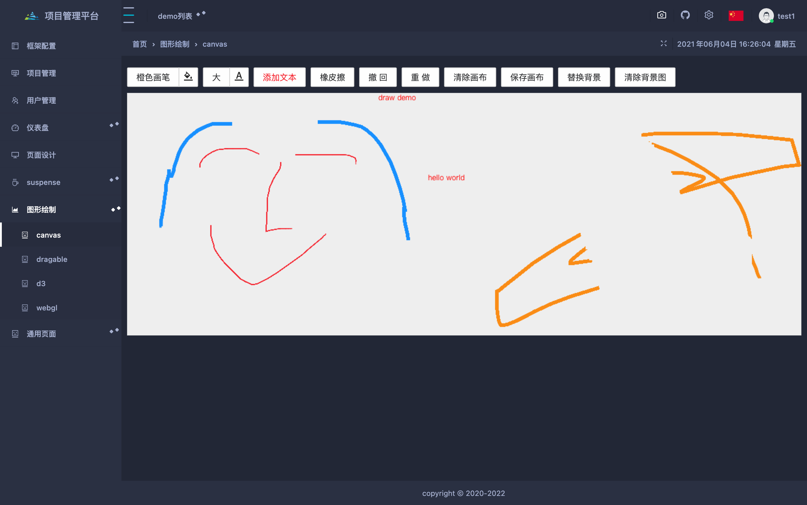

## canvas涂鸦板

canvas可以绘制图形、线条、文本、添加保存图片等功能，能帮助我们作一些可视化图形、特效、游戏等。

今天使用canvas简单制作一个涂鸦板。

canvas涂鸦板可以实现自动涂鸦，自定义背景图、添加文本内容、改变画笔颜色大小、保存涂鸦图片等功能。



### 实现

#### draw功能函数

涂鸦板要实现的一些功能：

**画笔颜色、大小设置、橡皮擦、文本编辑、清除画布、撤销、重做、保存图片。**

```javascript
const init=(ref,defCfg,imgRef,imgUrl)=>{
  setCfg(defCfg);
  imgUrl&&loadImg(imgRef,imgUrl,ref);
  const destroy=initStart(ref,startEvent,moveEvent,endEvent);
  return {
    destroy,
    color:value=>setCfg({color:value,type:'draw'}),
    size:value=>setCfg({size:value,type:'draw'}),
    eraser:()=>setCfg({type:'eraser'}),
    text:()=>setCfg({type:'text'}),
    clean:()=>{clearRect(ref);setCfg({type:'draw'});},
    undo:()=>prev(ref),
    redo:()=>next(ref),
    save:name=>dlfile(ref.toDataURL(),name),
  };
};

```

setCfg主要用于设置

- 当前画笔类型，有：draw、eraser、text三种
- 画笔颜色：自定义
- 画笔大小：自定义

loadImg用于加载我们定义的背景图。

#### 鼠标或触摸事件监听

判断是否支持触摸事件。

```javascript
const eventTargets=()=>isTouch?{
  startEvt:'touchstart',
  moveEvt:'touchmove',
  endEvent:'touchend',
}:{
  startEvt:'mousedown',
  moveEvt:'mousemove',
  endEvt:'mouseup',
};

```

监听事件

```javascript
const initStart=(startEvt,ref,startEvent)=>{
  ref.addEventListener(startEvt,startEvent,false);
};
const destroyStart=(startEvt,ref,startEvent)=>{
  ref.removeEventListener(startEvt,startEvent,false);
};
const handleStart=(moveEvt,endEvt,ref,moveEvent,endEvent)=>{
  ref.addEventListener(moveEvt,moveEvent,false);
  document.addEventListener(endEvt,endEvent,false);
};
const handleEnd=(moveEvt,endEvt,ref,moveEvent,endEvent)=>{
  ref.removeEventListener(moveEvt,moveEvent,false);
  document.removeEventListener(endEvt,endEvent,false);
};

```

#### 创建图片

```javascript
const createImg=(canvas,url)=>{
  const {width,height}=canvas;
  const ctx=canvas.getContext('2d');
  const img=new Image();
  img.src=url;
  img.onload=function(){
    ctx.drawImage(img,0,0,width,height);
  };
  return img;
};

```

#### 绘制过程

根据type类型来确定当前画笔执行哪种操作，有绘制、橡皮擦、写文本三种。文本编写放在endEvent函数里面触发。

```javascript
const moveEvent=(evt,canvas)=>{
  evt.preventDefault();
  const ctx=canvas.getContext('2d');
  const {x,y}=getRelative(evt,canvas);
  const type=getCfg('type');
  const size=getCfg('size');
  if(type==='draw'){
    const color=getCfg('color');
    ctx.lineWidth=size;
    ctx.strokeStyle=color;
    ctx.lineTo(x,y);
    ctx.stroke();
  }else if(type==='eraser'){
    ctx.lineWidth=size;
    ctx.clearRect(x-size*10,y-size*10,size*20,size*20);
  }
};

```

#### 添加文本

```javascript
const drawText=(evt,canvas)=>{
  const ctx=canvas.getContext('2d');
  const {touchX,touchY}=getTouchPosition(evt);
  const {left,top,right,bottom}=canvas.getBoundingClientRect();
  const textArea=createNote(touchX,touchY,right,bottom);
  textArea.focus();
  textArea.addEventListener('blur',event=>{
    const txt=textArea.value;
    ctx.font='12px 微软雅黑';
    ctx.fillStyle='red';
    ctx.fillText(txt,touchX-left,touchY-top);
    removeNote(textArea);
  },false);
};

```

根据点击位置，来创建textarea文本书写框位置，createNote函数创建extarea，通过focus、blur来控制创建或销毁。

#### 撤销和重做

```javascript
import {utils} from '@common';
const {record,undo,redo}=cacheData();

```

record记录数据，undo获取当前数据的上一记录结果，redo获取当前数据的下一个数据

#### 清除画布

```javascript
const clearRect=canvas=>{
  const {width,height}=canvas;
  const ctx=canvas.getContext('2d');
  ctx.clearRect(0,0,width,height);
};

```

#### 保存图片

```javascript
const saveData=canvas=>record(canvas.toDataURL());

```

#### 下载图片

```javascript
save:name=>dlfile(ref.toDataURL(),name)

```



这样，一个简易涂鸦板就出来了。

[在线demo](http://ihuxy.com/canvas/canvas)