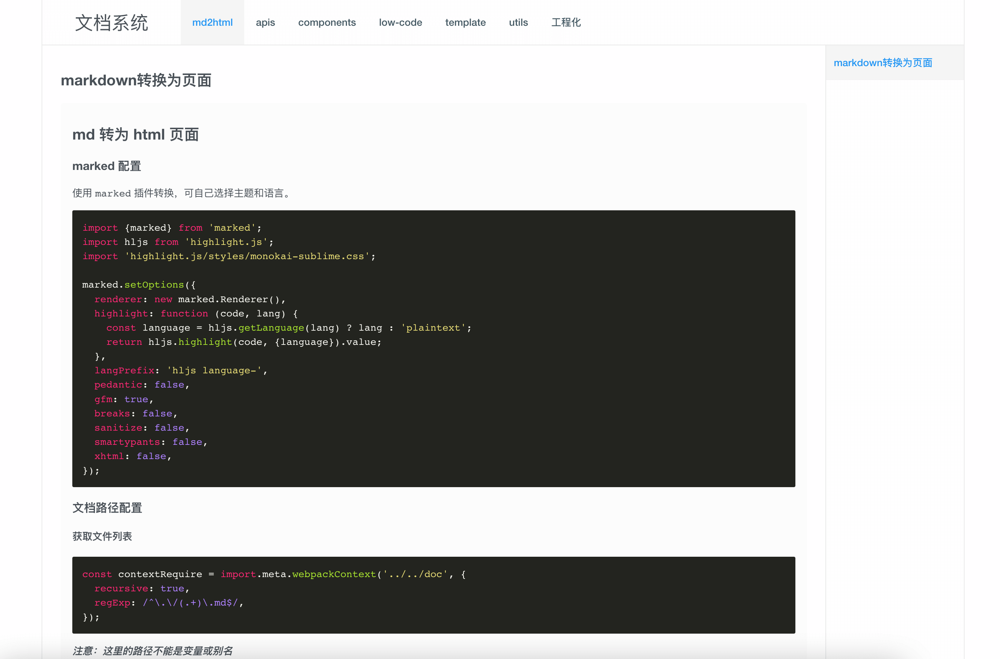
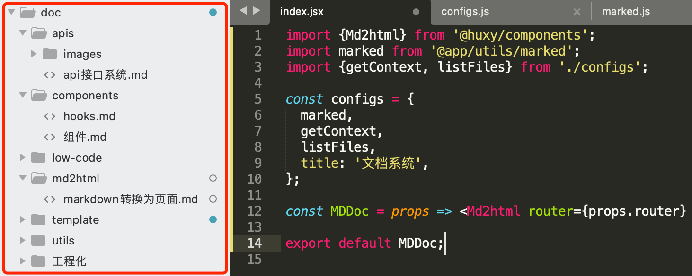

## md 转为 html 页面

### marked 配置

使用 `marked` 插件转换，可自己选择主题和语言。

```javascript
import {marked} from 'marked';
import hljs from 'highlight.js';
import 'highlight.js/styles/monokai-sublime.css';

marked.setOptions({
  renderer: new marked.Renderer(),
  highlight: function (code, lang) {
    const language = hljs.getLanguage(lang) ? lang : 'plaintext';
    return hljs.highlight(code, {language}).value;
  },
  langPrefix: 'hljs language-',
  pedantic: false,
  gfm: true,
  breaks: false,
  sanitize: false,
  smartypants: false,
  xhtml: false,
});
```

### 文档路径配置

#### 获取文件列表

```javascript
const contextRequire = import.meta.webpackContext('../../doc', {
  recursive: true,
  regExp: /^\.\/(.+)\.md$/,
});
```

**_注意：这里的路径不能是变量或别名_**

#### 获取文件名

获取文件目录及文件名，可进行排序操作。

```javascript
const listFiles = async () => {
  const list = await contextRequire.keys().map(name => ({name: name.replace(/^\.\/(.+)\.md$/, '$1')}));
  const firstIndex = list.findIndex(({name}) => name.includes('md2html/'));
  const firstItem = list.splice(firstIndex, 1);
  return [...firstItem, ...list];
};
```

#### 获取 md 文件内容

```javascript
const getContext = async ({folder, name, type = ''}) => (await import(`@app/doc/${folder}/${name}${type}`))?.default;
```

### 使用

```javascript
import {Md2html} from '@huxy/components';
import marked from '@app/utils/marked';
import {getContext, listFiles} from './configs';

const configs = {
  marked,
  getContext,
  listFiles,
  title: '文档系统',
};

const MDDoc = props => <Md2html router={props.router} params={props.params} {...configs} />;

export default MDDoc;
```

效果如下：



文档的增删改查操作直接在文档目录下操作 md 文件即可，页面可实时刷新。



[预览地址](https://ihuxy.com/md2html)
