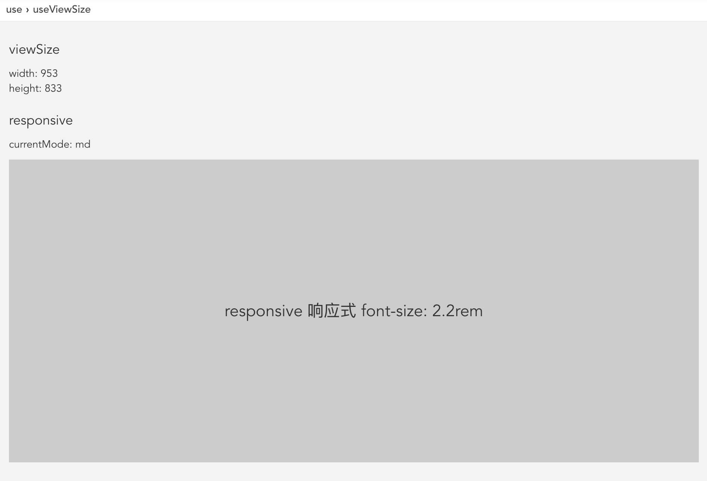

## useViewSize

获取当前窗口大小，实现响应式操作。

### 使用示例

    const Index=props=>{
      const {width,height}=useViewSize();
      const keys=Object.keys(responsiveConfig);
      let current;
      for(let i=0,l=keys.length;i<l;i++){
        const key=keys[i];
        if(width>responsiveConfig[key]){
          current=key;
          break;
        }
      }
      return 

        

          <section style={{fontSize:'1.8rem',padding:'10px 0'}}>viewSize</section>
          
width: {width}

          
height: {height}

        

        

          <section style={{fontSize:'1.8rem',padding:'10px 0'}}>responsive</section>
          currentMode: {current}
        

        

          responsive 响应式 font-size: {fz[current]}
        

      
;
    };

#### 使用说明

使用简单，直接使用 `useViewSize`就行。

    const {width,height}=useViewSize();

### 实现方式

#### useRaf

使用 `requestAnimationFrame` 来节流。

    const useRaf=initialState=>{
      const frame=useRef(0);
      const [state,setState]=useState(initialState);
      const setRaf=useCallback(value=>{
        cancelAnimationFrame(frame.current);
        frame.current=requestAnimationFrame(()=>{
          setState(value);
        });
      },[]);
      useEffect(()=>{
        return ()=>cancelAnimationFrame(frame.current);
      },[]);
      return [state,setRaf];
    };

#### useViewSize

监听窗口变化。

    const useViewSize=()=> {
      const [state,setRaf]=useRaf(getViewportSize());
      useEffect(()=>{
        const handler=()=>setRaf(getViewportSize());
        window.addEventListener('resize',handler,false);
        return ()=>{
          window.removeEventListener('resize',handler,false);
        };
      },[]);
      return state;
    };
