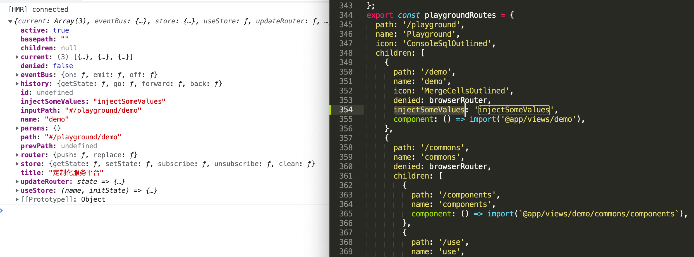

# useRouter

## 安装

```
pnpm i @huxy/router

```

## 使用

```javascript
import {useRouter, Link, useRoute} from '@huxy/router';
```

### useRouter

useRouter 是路由入口，传入路由配置信息，返回 页面元素 output、加载状态 loading、更新函数 updateRouter 等。

```javascript
const {output, loading, updateRouter} = useRouter(routerCfgs);
```

#### 入参信息

```javascript
const others = {
  projectKey: '123',
};

const input = {
  browserRouter: false, //是否为browserHistory
  idKey: 'path', //路由key值。如：url
  childKey: 'children', //子层级key值。如：children
  beforeRender: () => {}, //渲染前回调函数。
  afterRender: () => {}, //渲染完回调函数。
  basepath: '', //路由前缀。
  routers: [], //路由表
  store: () => {}, //状态管理函数
  inputPath: '', //初始化路由
  inputParams: {}, //初始化参数
  // 全局
  title: 'test', //页面title。
  errorBoundary: null, //错误边界。默认有错误边界处理，可自定义。
  loading: null, //加载效果。默认有加载效果，可自定义。
  exact: false, //绝对路径
  ...others, //其它配置
};

const {output} = useRouter(input);
```

这里传的配置为全局配置，单个路由信息配置可在路由表信息里面配置。

#### 出参信息

```javascript
const {
  //订阅发布功能
  eventBus: {on, emit, off},
  //路由跳转
  router: {push, replace},
  //状态管理
  store: {getState, setState, subscribe},
  updateRouter, //更新路由
  output, //当前路径下页面
  loading, //是否加载中
} = output;
```

例如：

```javascript
const App = ({routerCfgs}) => {
  const {output, loading, updateRouter} = useRouter(routerCfgs);
  useEffect(() => {
    const cancelLang = langStore.subscribe(async lang => {
      storage.set('language', lang);
      await getI18n();
      updateRouter(getRouterCfgs());
    });
    return () => {
      cancelLang();
    };
  }, []);
  return (
    <>
      {output}
      {loading && <Spinner global />}
    </>
  );
};
```

`updateRouter` 可更新整个路由配置。

#### 路由表配置

```javascript
const routers = {
  path: '', //路径
  name: '', //展示名
  icon: '', //图标
  redirect: '', //重定向
  children: [], //子菜单配置
  component: '', //页面组件
  denied: false, //权限控制
  hideMenu: false, //菜单隐藏展示
  resolve: null, //数据请求并缓存，可用store.getState(key)获取，store.setState(state)更新。
  loadData: null, //数据请求，不缓存数据。
  // 单个路由配置
  title: 'test', //页面title。
  errorBoundary: null, //错误边界。默认有错误边界处理，可自定义。
  loading: null, //加载效果。默认有加载效果，可自定义。
  exact: false, //绝对路径
  ...others, //其它配置
};
```

默认进入第一个路径，也可自行设置，如通过 `redirect` 设置默认进入到指定路径。

`exact` 为 `true` 是使用绝对路径，默认为 `false`，会带入 `basepath` 和父路径。

`path` 提供动态路由，如：`/a/:id/:name` 。



#### 页面路由信息

每个路由都注册了一些基本信息，如：路由操作 router、前进后退 history、状态管理 store、当前面包屑 current、传入路径 inputPath、传入参数 params 等。也会将当前路由特定配置返回。

```javascript
const {
  //订阅发布功能
  eventBus: {on, emit, off},
  //路由跳转
  router: {push, replace},
  //状态管理
  store: {getState, setState, subscribe},
  updateRouter, //跟新路由
  //浏览器history
  history: {getState, back, forward, go},

  current, //当前路由列表，包含父级所有路由信息
  inputPath, //传入的路径
  path, //当前路径
  params, //页面参数
  name, //页面名称
  basepath, //路由前缀
  children, //子组件
  open, //是否为打开状态
  active, //是否为选中状态
} = props;
```

#### push & replace

```javascript
router.push('/a/b/c');

router.push({
  path: '/a/b/c',
  params: {id: 123},
  query: {name: 'aaa'},
  state: {uid: '000'},
});

// 相对路径
router.push('./b/c');
```

`replace` 同 `push` 。

#### history

- getState：获取 `history.state` 。
- go：跳转。
- forward：前进。
- back：后退。

## Link

```javascript
<Link {...props} />
```

### Link 属性

```javascript
const props = {
  to: '', //跳转路径
  onClick, //点击事件。除了跳转外的其它事件，一般不设置。
  preventDefault: false, //阻止默认事件
  stopPropagation: true, //阻止冒泡
  exact: true, //是否为绝对路径
  children, //子组件
  target: null, //新开窗口打开方式
  disabled: false, //禁用点击
  ...rest, //其它配置
};
```

#### to 属性配置

```javascript
to = '/a/b/c';

to = {
  path: '/a/b/c',
  params: {id: 123},
  query: {name: 'aaa'},
  state: {uid: '000'},
};

// 相对路径
to = './b/c';
```

同 `push` 。

## useRoute

```javascript
const routerCfgs = useRoute();
```

返回当前路由的配置信息，同 页面路由信息，路由改变时会触发配置信息的更新。
