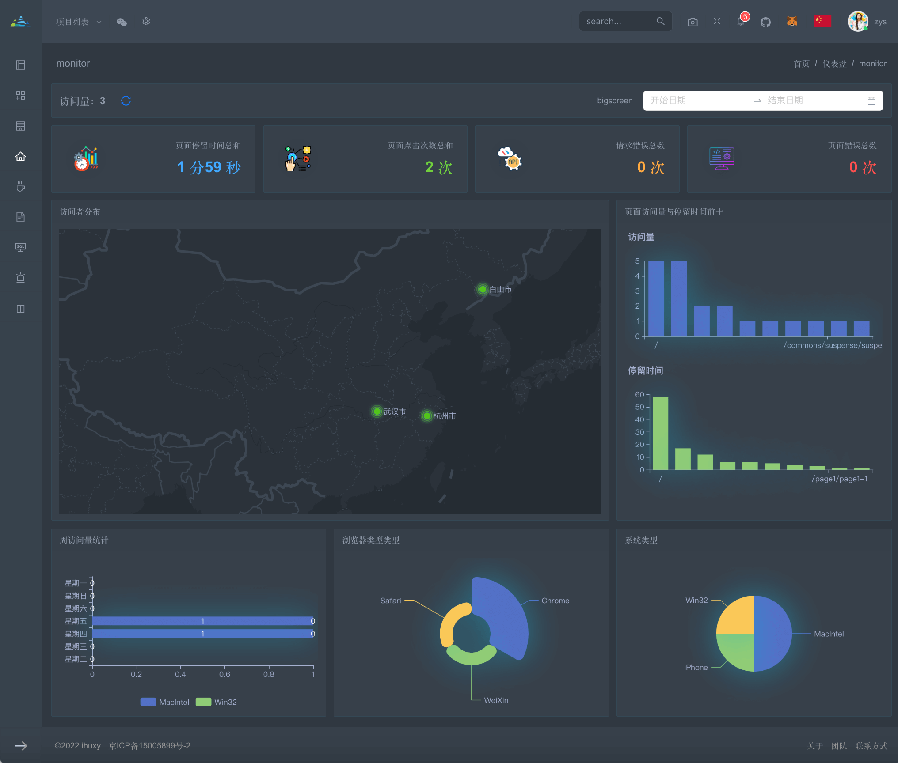
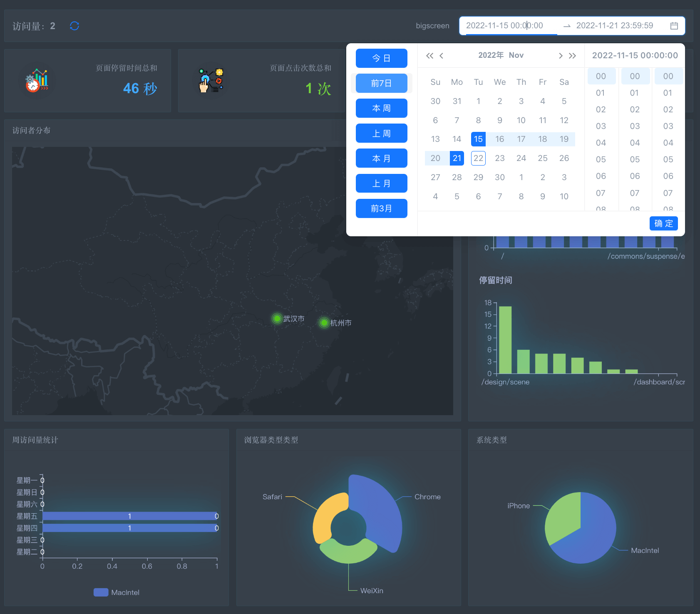
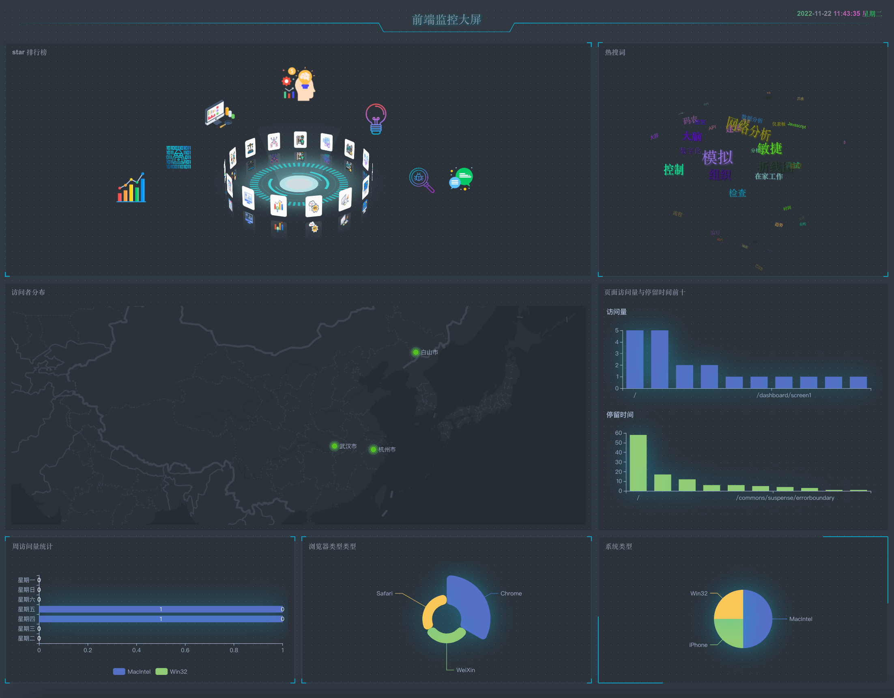

## 大屏之页面监控系统

前面讲了怎样通过埋点来实现 [前端监控系统](https://mp.weixin.qq.com/s/__6uh-wPaVP66ycr24b16Q) ，今天我们来实现将监控到的信息用大屏展示出来。



### 数据分析

我们可以将得到的数据根据我们的关注点来进行分类展示，以便更直观的了解用户信息及其关注点。

例如，我们可以通过如下维度来展示信息：

- 时间维度，如：本周、上周、前 7 天、上个月等时间维度来获取数据。
- 访问量。
- 页面停留时间、点击次数、请求错误次数、页面报错次数。
- 用户分布地图。
- 路由访问量与停留时间排行。
- 系统类型、浏览器类型、周访问量趋势图。
- 其它，如 跳转页面排行、热搜词等。



### 技术实现

主要使用图表、地图、动效来展示，例如使用 `echarts` 图表库。一些动效及个性化需求可根据设计来实现，主要使用 `css` 来完成展示效果，主题切换可使用 `css` 变量来控制。

#### charts 组件

```
const ReactChart = ({style, option, ...rest}) => {
  const rerender = useUpdate();
  const [, setState, subscribe] = useStore('huxy-react-echarts', false);
  useEffect(() => {
    const cancelSub = subscribe(result => {
      result && rerender();
    });
    const getCharts = async () => {
      charts = 'loading';
      try {
        const echarts = await import('echarts');
        echarts.registerTheme('dark-screen', darkScreen);
        charts = echarts;
        setState(true);
      } catch(err) {
        charts = {
          error: 'load error',
        };
        setState(true);
      }
    };
    !charts && getCharts();
    return () => cancelSub();
  }, []);
  if (typeof charts !== 'object') {
    return <Spinner />;
  }
  return <ECharts {...rest} option={typeof option ==='function' ? option(charts) : option} theme="dark-screen" style={{...style}} />;
};
```

使用：

```
<Row>
  <Col span={8}>
    <Panel title={visitCityOpt.name}>
      <ReactChart option={visitCityOpt.opt} style={{height: '450px'}} />
    </Panel>
  </Col>
  <Col span={4}>
    <Panel title={routeVisitOpt.name}>
      <ReactChart option={routeVisitOpt.opt} style={{height: '450px'}} />
    </Panel>
  </Col>
</Row>
```

#### 数据分类

`charts` 通用数据配置：

```javascript
const option = (name, data) => ({
  tooltip: {
    trigger: 'item',
    formatter: '{a} <br/>{b} : {c} ({d}%)',
  },
  series: [
    {
      name,
      type: 'pie',
      radius: '50%',
      center: ['50%', '50%'],
      data,
      emphasis: {
        itemStyle: {
          shadowBlur: 10,
          shadowOffsetX: 0,
          shadowColor: 'rgba(0, 0, 0, 0.5)',
        },
      },
    },
  ],
});
```

对接口返回数据分类、排序等：

```javascript
export const getOsTypeOpt = list => {
  const osTypeObj = classifyArr(list, 'osType');
  const optData = Object.keys(osTypeObj).map(key => ({
    name: key,
    value: unique(osTypeObj[key], 'ip').length ?? 0,
  }));
  return {
    opt: osTypeOpt('系统：', optData),
    name: '系统类型',
  };
};
```



[演示地址](http://ihuxy.com/dashboard/monitor)
