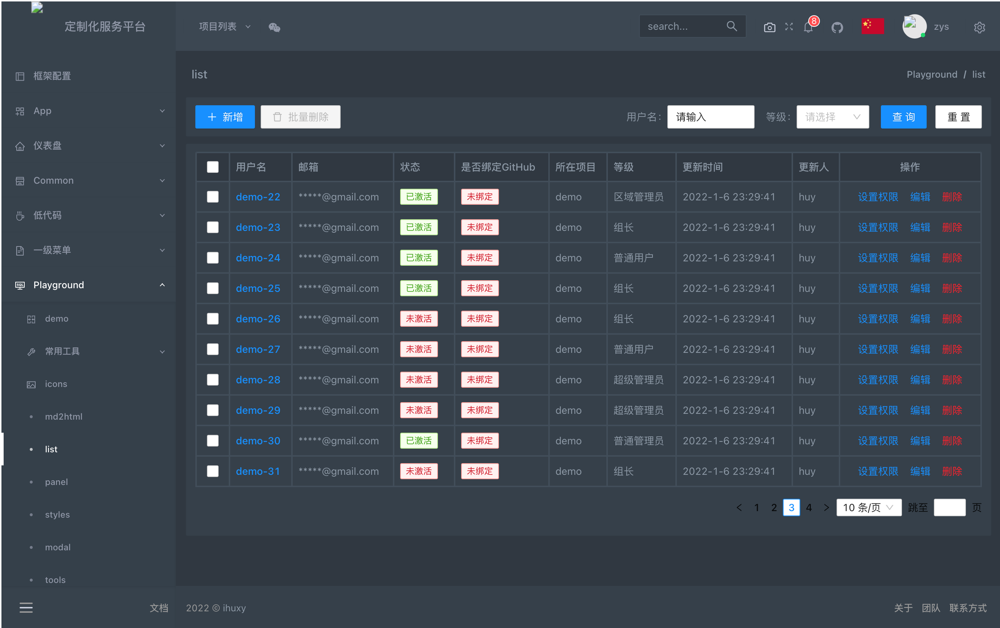
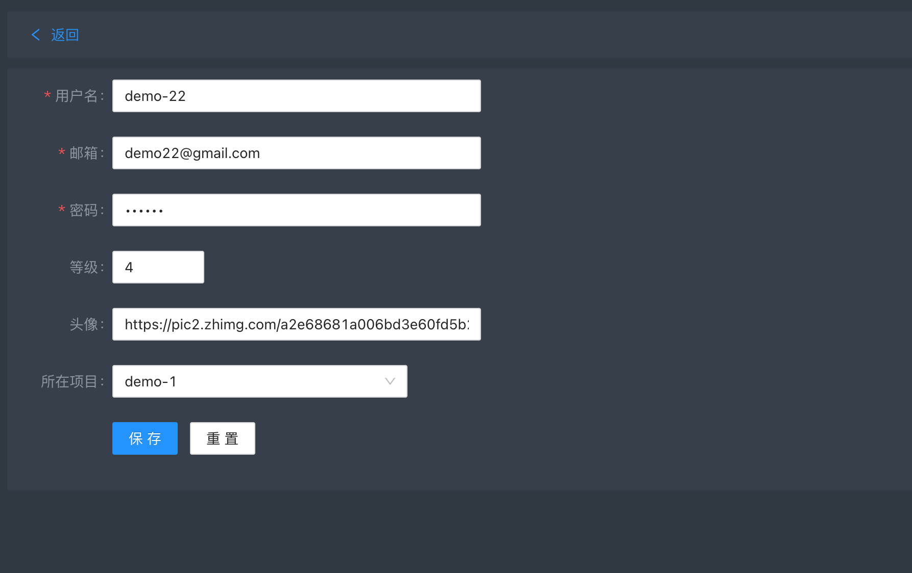
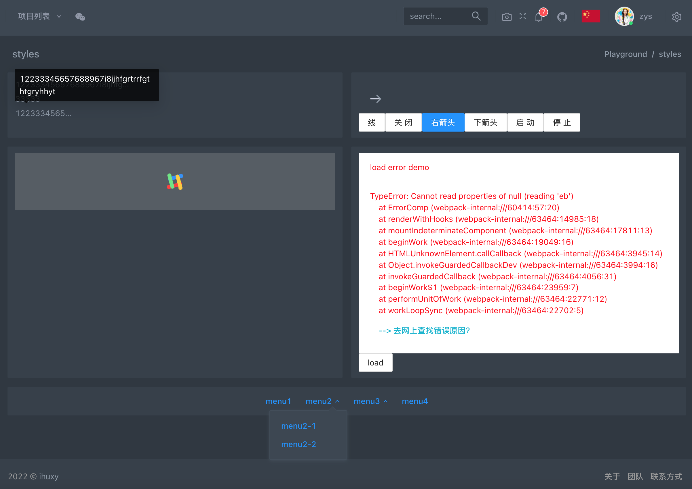
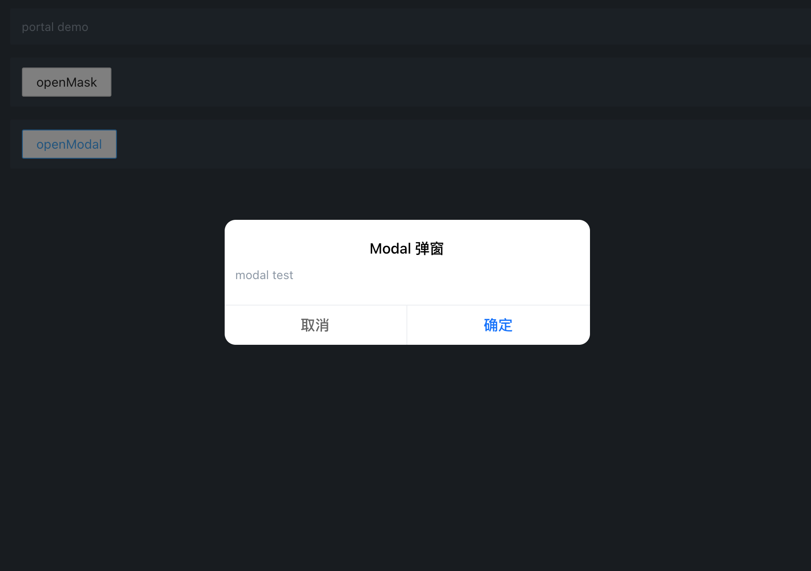
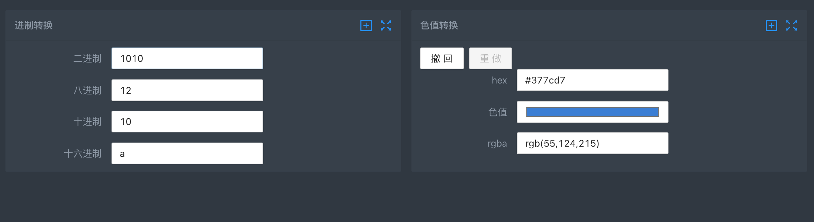
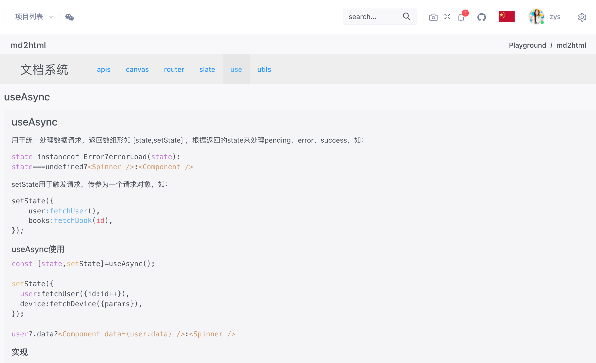
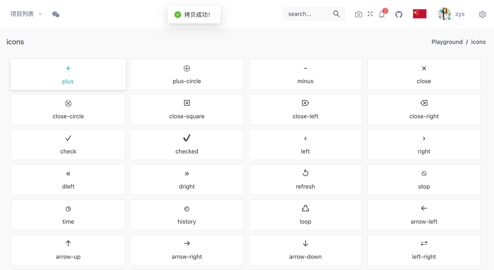
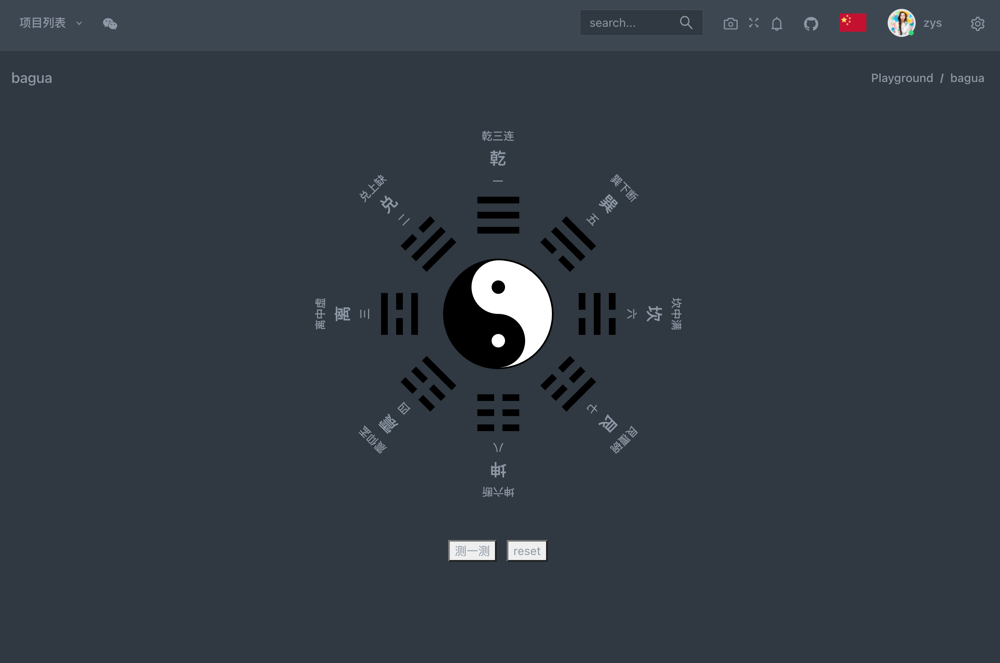

## 常用小功能代码片段

### list 列表

#### useFetchList

```js
const useFetchList = (fetchList, commonParams = null, initParams = null, handleResult) => {
  const [result, updateResult] = useAsync({});
  const update = useCallback((params) => updateResult({res: fetchList({...params, ...commonParams})}, handleResult), []);
  useEffect(() => {
    update({...initParams});
  }, []);
  const {res} = result;
  const isPending = !res || res.pending;

  return [{isPending, data: res?.result}, update];
};
```

使用：

```js
const [list, updateList] = useFetchList(getRouter, {projectId: defProject._id});
```

可通过 `updateList ` 更新列表。

#### useHandleList - 带分页、搜索的列表



参数示例：

- fetchList：请求函数
- commonParams：公共参数
- initParams：默认参数
- handleResult：返回结果处理（格式化等）。

```js
const useHandleList = (fetchList, commonParams = null, initParams = null, handleResult) => {
  const {current, size, ...rest} = initParams || {};
  const search = useRef(rest || {});
  const page = useRef({current: current || 1, size: size || 10});
  const [result, update] = useFetchList(fetchList, commonParams, {...page.current, ...search.current}, handleResult);

  const pageChange = (current, size) => {
    page.current = {current, size};
    update({
      ...page.current,
      ...search.current,
    });
  };
  const searchList = (values) => {
    search.current = values;
    page.current = {...page.current, current: 1};
    update({...page.current, ...search.current});
  };

  return [result, (params) => update({...page.current, ...search.current, ...params}), pageChange, searchList];
};
```

使用：

```js
const [result, update, pageChange, searchList] = useHandleList(allUser, null, {current: pageParams?.current, size: pageParams?.size});

const pagination = {
  onShowSizeChange: (current, size) => pageChange(current, size),
  onChange: (current, size) => pageChange(current, size),
  showSizeChanger: true,
  showQuickJumper: true,
  total: total || 1,
  current: current || 1,
  pageSize: size || 10,
  pageSizeOptions: ['10', '20', '30', '40'],
};

<SearchForm submit={searchList} loading={isPending} searchFormText={searchFormText} />;
```

这两个列表查询 hooks 都是基于 [useAsync](https://mp.weixin.qq.com/s?__biz=MzAwOTI3MTk3Nw==&mid=2455985907&idx=1&sn=f37e7e9ec55cac6e2336b4f6989cdbe9&chksm=8cf5d135bb825823703137904ca4400465eca147ddde1b7b5347df80d70d55c4222e6f7ac062&token=1538888772&lang=zh_CN#rd) 封装的，便于列表查询。

#### useSearch

使用：

```js
const [filterTree, setFilterTree] = useSearch(null);

const searchTree = (value) => setFilterTree(tree, value, 'name', 'path');

<Search placeholder="search..." allowClear enterButton style={{maxWidth: '240px', marginBottom: '12px'}} onSearch={searchTree} />;
```

#### useDebounce

防止频繁操作引起的性能问题。

如 search：

```js
const [filterTree, setFilterTree] = useSearch(null);

const searchChange = useDebounce((e, data) => {
  const {value} = e.target;
  setFilterTree(data, value, 'name', 'path');
}, 500);

<Search placeholder="search..." allowClear enterButton style={{maxWidth: '240px', marginBottom: '12px'}} onChange={(e) => searchChange(e, data)} />;
```

使用：`useDebounce(fn,delay)`，第二个参数 `delay` 设置时间间隔。

### hooks

#### useStore

状态管理工具。

`const [list,update,subscribe]=useStore('userList',{});`

参数示例：

- key：userList
- 默认值：{}
- list：value 值
- update：更新函数
- subscribe：监听函数

```js
const Page1 = (props) => {
  const [list, update] = useStore('userList', []);
  const deleteUse = async (id) => {
    await fetchDel({id});
    update();
  };
};

const Page2 = (props) => {
  const [, , subscribe] = useStore('userList', []);
  useEffect(() => {
    subscribe((result) => {
      console.log(result);
    });
  }, []);
};
```

#### useRoute

将路由数据解耦出来。

`const {path,name,router,store,...} = useRoute();`

可在此监听路由跳转。

#### useEleResize

监听元素大小变化。

`const {width,height} = useEleResize(ref, delay);`

`useEleResize`有 2 个参数：

- 监听元素：ref
- 监听时间间隔（防抖）：delay

```js
const {width} = useEleResize(skeletonRef, 300);

<Panel title="skeleton" ref={skeletonRef}>
  panelWidth: {width}
</Panel>;
```

#### useClickAway

元素外面点击事件监听。

`useClickAway(ref, fn);`

- 监听元素：ref
- 事件操作：fn

```js
const liRef = useRef();
useClickAway(liRef, (e) => li.open && itemClick(e, li));

<li ref={liRef}>...</li>;
```

#### useTime

当前时间。

```jsx
const useTime = () => {
  const timeRef = useRef();
  const [time, setTime] = useState('');
  useEffect(() => {
    const getFormatTime = () => {
      timeRef.current = setInterval(() => setTime(formatTime()), 1000);
    };
    getFormatTime();
    return () => clearInterval(timeRef);
  }, []);

  return [time];
};
```

### Mock 数据

#### fakeFetch

```js
export const fakeFetch = async (params) => {
  await sleep();
  return {
    code: 200,
    message: 'success！',
    result: {},
  };
};
```

#### schema

```js
const userSchema = {
  name: 'demo',
  email: 'demo@gmail.com',
  password: '123456',
  role: 2,
  token: uuidv4(),
  projectName: 'demo',
  projectId: 'demo-1',
  description: 'demo',
  active: 1,
  createtime: +new Date(),
  updatetime: +new Date(),
  creator: 'huy',
  updater: 'huy',
  avatar: 'https://pic2.zhimg.com/a2e68681a006bd3e60fd5b22d51cb629_im.jpg',
  github: '',
};
```

#### fakeList

```js
export const fakeUsers = (schema, num = 10) =>
  [...Array(num)].map((item, index) => ({...schema, _id: uuidv4(), name: `${schema.name}-${index + 1}`, email: `${schema.name}${index + 1}@gmail.com`, role: randNum(5), active: randTrue()}));

export const users = fakeUsers(userSchema, 36);
```

#### 数据持久化 - 增删改查

```js
export const addUser = async (data) => {
  const res = await fakeFetch();
  const item = {...data, _id: uuidv4()};
  const users = store.getState('users');
  users.push(item);
  store.setState({users});
  return {
    ...res,
    result: item,
  };
};

export const allUser = async ({type, current, size, name, role}) => {
  const res = await fakeFetch();
  const users = store.getState('users');
  const index = size * (current - 1);
  let temp = [];
  if (type) {
    temp = users.filter((item) => item.type === type);
  } else {
    temp = [...users];
  }
  let list = [...temp];
  if (role) {
    list = list.filter((item) => item.role === role);
  }
  if (name) {
    const reg = new RegExp(name, 'gi');
    list = list.filter((item) => item.name.toString().match(reg));
  }
  list = list.slice(index, index + size);
  return {
    ...res,
    result: {
      current,
      size,
      total: temp.length,
      list,
    },
  };
};
```

通过 `store.getState()`、 `store.setState()` 来获取和修改数据。

### 路由

#### 路由钩子 - beforeRender

在路由渲染前做一些处理。

**_合法性校验_**

```js
if (validPath === initPath) {
  return next({path: '/'});
}
```

**_鉴权_**

```js
if (validPath === initPath) {
  return next({path: '/'});
}
```

**_页面离开时提示_**

```js
if (path !== prevPath && demoBackReg.test(prevPath)) {
  return confirmDesignPage(next);
}
```

**_记录页面停留时间_**

```js
routerListenFn(path, prevPath);
```

#### 页面刷新保留参数

```js
// list.jsx

router.push({
  path: `./auth/${item._id}`,
  state: {item, backState: {path: props.path, params: {current, size}}},
});
```

- path：路由地址
- state：参数，可刷新保存

获取：

```js
// add.jsx

const {getState} = props.history;

const {item, backState} = getState() || {};
```

页面刷新后，参数保存。

#### 返回时保存跳转前的状态

如：列表页码、搜索条件、树节点选中等状态。

```js
const {getState} = props.history;
const {item, backState} = getState() || {};

const back = () => {
  backState ? props.router.push(backState) : props.history.back();
};
```

获取状态：

```js
const pageParams = props.params;
const [result, update, pageChange, searchList] = useHandleList(allUser, null, {current: pageParams?.current, size: pageParams?.size});
```

#### goBack 组件



```js
const Index = ({back, actions = []}) => {
  const {store} = useRoute();
  const i18ns = store.getState('i18ns');
  const i18nCfg = i18ns?.main.components ?? {};
  return (
    <Panel>
      <Button onClick={(e) => (typeof back === 'function' ? back() : history.back())} type="link" size="small" icon={fixIcons('LeftOutlined')}>
        {i18nCfg.back}
      </Button>
      {actions.map(({text, icon, ...rest}) => (
        <Button key={text} size="small" {...rest} icon={fixIcons(icon)}>
          {text}
        </Button>
      ))}
    </Panel>
  );
};
```

### components



#### Spinner

```jsx
<Spinner global />
```

#### HandleError

```jsx
<HandleError>
  <ErrorComp state={demoError} name="eb" />
</HandleError>
```

#### Ellipsis

当文本超过宽度时出现省略号并有 tooltips。

```jsx
<div style={{width: 200}}>
  <Ellipsis>12233345657688967i8ijhfgrtrrfgthtgryhhyt</Ellipsis>
</div>
```

#### portal

```jsx
const Index = ({children, mountNode = document.body}) => createPortal(children, mountNode);
```

#### mask

```jsx
const Mask = ({open, close, delay = 300, children, mountNode}) => {
  const [delayOpen] = useDelayDestroy(open, delay);
  return (
    <Portal mountNode={mountNode}>
      <div>
        {delayOpen ? (
          <div style={wrapper}>
            <div style={mask} onClick={close} />
            <div style={container}>{children}</div>
          </div>
        ) : null}
      </div>
    </Portal>
  );
};
```

#### modal



```jsx
const Modal = ({open, cancel, submit, title = 'Modal 弹窗', className, children, delay = 0}) => {
  const cls = ['modal-wrap', open ? 'open' : '', className].filter(Boolean).join(' ');
  return (
    <Mask open={open} close={cancel} delay={delay}>
      <div className={cls}>
        <div className="modal-container">
          <div className="modal-header">{title}</div>
          <div className="modal-content">{children}</div>
          <div className="modal-footer">
            <div className="btn left" onClick={(e) => cancel?.()}>
              取消
            </div>
            <div className="btn right" onClick={(e) => submit?.()}>
              确定
            </div>
          </div>
        </div>
      </div>
    </Mask>
  );
};
```

#### fullScreen - 全屏

```jsx
const Index = ({panel, fullIcon = defaultIcon, exitIcon = defaultIcon}) => {
  const container = panel?.current ?? panel;
  const [isFull, setIsFull] = useState();
  useEffect(() => {
    const destroy = watchScreen(() => {
      setIsFull((prev) => !prev);
    });
    return () => destroy();
  }, []);
  const Icon = isFull ? exitIcon : fullIcon;
  return <Icon onClick={(e) => fullScreen(container)} />;
};
```

#### maxSize - 最大化

最大化，可将目标元素最大化到指定节点。

```jsx
const Index = ({panel, target, fullIcon = defaultIcon, exitIcon = defaultIcon}) => {
  const [isMax, setIsMax] = useState();
  const panelRef = useRef();
  const targetRef = useRef();
  useEffect(() => {
    const getTarget = typeof target === 'function' ? target : () => document.getElementsByClassName(target)[0];
    targetRef.current = getStyles(getPosition(getTarget()));
    panelRef.current = {
      ...maxStyle,
      ...getStyles(getPosition(panel.current)),
    };
  }, []);
  const handle = useCallback((isMax) => {
    if (isMax) {
      setStyles(panel.current, panelRef.current);
      setTimeout(() => {
        setStyles(panel.current, targetRef.current);
      }, 0);
    } else {
      resetStyles(panel.current, panelRef.current);
    }
    setIsMax(isMax);
  }, []);
  const Icon = isMax ? exitIcon : fullIcon;
  return <Icon onClick={(e) => handle(!isMax)} />;
};
```

### utils



#### 日期格式化

```js
export const getTime = (day = new Date()) => {
  const date = new Date(day);
  const y = date.getFullYear();
  const w = date.getDay();
  const m = date.getMonth() + 1;
  const d = date.getDate();
  const h = date.getHours();
  const M = date.getMinutes();
  const s = date.getSeconds();
  return [y, m, d, h, M, s, w];
};
```

#### 时间间隔

```js
export const getMonthDays = (day = new Date()) => {
  const date = getTime(day);
  return new Date(date[0], date[1], 0).getDate();
};

export const timeBase = (date) => [12, getMonthDays(date), 24, 60, 60];

export const timeUnit = ['年', '月', '日', '时', '分', '秒'];

export const minus = (start, end, base) => {
  let carry = false;
  const gap = [];
  end.map((v, i) => {
    const endValue = carry ? v - 1 : v;
    const diff = endValue - start[i];
    if (diff < 0) {
      gap[i] = diff + (base[i] || 10);
      carry = true;
    } else {
      gap[i] = diff;
      carry = false;
    }
  });
  return gap.reverse();
};

export const timeInterval = (start, end = new Date()) => {
  if (new Date(start) - new Date(end) > 0) {
    start = [end, (end = start)][0];
  }
  const base = timeBase(end).reverse();
  const sDate = getTime(start).slice(0, -1).reverse();
  const eDate = getTime(end).slice(0, -1).reverse();
  return minus(sDate, eDate, base);
};

export const timeGap = (start, end = new Date()) => {
  const gap = timeInterval(start, end);
  const index = gap.findIndex((v) => v > 0);
  const unitTime = gap.map((v, i) => `${v || 0}${timeUnit[i]}`);
  return unitTime.slice(index).join('');
};
```

#### 进制转换

```js
export const base2Ten = (num, base = 2) => parseInt(String(num), base);

export const ten2Base = (num, base = 2) => Number(num).toString(base);
```

#### 色值转换

```js
export const rgba2hex = (r = 0, g = 0, b = 0, a = 1) => {
  const hex = `#${((1 << 24) + (r << 16) + (g << 8) + b).toString(16).slice(1)}`;
  if (a === 1) {
    return hex;
  }
  a = Math.round(a * 255).toString(16);
  a = a.length === 1 ? `0${a}` : a.length === 3 ? 'ff' : a;
  return `${hex}${a}`;
};

export const hex2rgba = (hex) => {
  hex = hex.replace('#', '');
  const len = hex.length;
  if (len === 3) {
    hex = `${hex[0]}${hex[0]}${hex[1]}${hex[1]}${hex[2]}${hex[2]}`;
  } else if (len === 4) {
    hex = `${hex[0]}${hex[0]}${hex[1]}${hex[1]}${hex[2]}${hex[2]}${hex[3]}${hex[3]}`;
  }
  const r = parseInt(hex.slice(0, 2), 16) || 0;
  const g = parseInt(hex.slice(2, 4), 16) || 0;
  const b = parseInt(hex.slice(4, 6), 16) || 0;
  if (hex.length === 6) {
    return `rgb(${r},${g},${b})`;
  }
  const a = parseInt(hex.slice(6, 8), 16) / 255 || 0;
  return `rgba(${r},${g},${b},${a})`;
};
```

#### scroolTo - 滚动

```js
export const scrollToTop = (top = 0) => window.scrollTo({top, behavior: 'smooth'});

export const scrollToAnchor = (ref = document.body) => ref?.scrollIntoView?.({behavior: 'smooth', block: 'center'});

export const scrollTop = () => document.documentElement.scrollTop || window.pageYOffset || document.body.scrollTop;
```

#### arr2Tree

```js
export const arr2TreeById = (data, idKey = 'id', childKey = 'children', treeRoot = -1) =>
  arr2Tree((item) => {
    const id = item[idKey];
    const parentArr = id.match(/\S+(?=-\S+)/);
    return parentArr?.[0] || treeRoot;
  })(data, idKey, childKey, treeRoot);

export const arr2TreeByPath = (data, idKey = 'path', childKey = 'children', treeRoot = null) =>
  arr2Tree((item) => {
    const id = item[idKey];
    const hasSub = id.match(/.*\/[^:/]+\/:[^/]+/);
    if (hasSub) {
      return hasSub[0].match(/(.*)\/:+/)?.[1] ?? treeRoot;
    } else {
      return id.match(/(.*)\/+/)?.[1] ?? treeRoot;
    }
  })(data, idKey, childKey, treeRoot);
```

#### record

记录数据，可回退、重做、跳转等。

```js
const {record, undo, redo, clean} = cacheData();

useEffect(() => {
  setCurrentItem(record(''));
  return () => clean();
}, []);

const prev = () => {
  const item = undo();
  setCurrentItem(item);
  setColorValue(item.data);
};
const next = () => {
  const item = redo();
  setCurrentItem(item);
  setColorValue(item.data);
};
```

#### copyToClipboard

拷贝到粘贴板。

```js
const copyToClipboard = (text) => {
  const copyText = document.createElement('textarea');
  copyText.value = text;
  copyText.style.position = 'fixed';
  copyText.style.left = '-9999px';
  document.body.appendChild(copyText);
  copyText.select();
  copyText.setSelectionRange(0, -1);
  try {
    document.execCommand('copy');
  } catch (err) {
    console.error(err);
  }
  document.body.removeChild(copyText);
};
```

#### watermark


添加水印。

```js
const watermark = ({
  container = document.body,
  width = '220px',
  height = '200px',
  textAlign = 'center',
  textBaseline = 'middle',
  font = '20px microsoft yahei',
  fillStyle = 'rgba(202,202,202,0.4)',
  content = '请勿外传',
  rotate = '-30',
  zIndex = 1000,
} = {}) => {
  container = container?.current ?? container;
  const oldCanvas = container.firstChild;
  if (oldCanvas?.className === 'watermark-canvas') {
    container.removeChild(oldCanvas);
  }
  const canvas = document.createElement('canvas');
  canvas.setAttribute('width', width);
  canvas.setAttribute('height', height);
  const ctx = canvas.getContext('2d');

  ctx.textAlign = textAlign;
  ctx.textBaseline = textBaseline;
  ctx.font = font;
  ctx.fillStyle = fillStyle;
  ctx.rotate((Math.PI / 180) * rotate);
  ctx.fillText(content, parseFloat(width) / 2, parseFloat(height) / 2);

  const base64Url = canvas.toDataURL();
  const watermarkDiv = document.createElement('div');
  watermarkDiv.setAttribute(
    'style',
    `
    position:absolute;
    top:0;
    left:0;
    width:100%;
    height:100%;
    z-index:${zIndex};
    pointer-events:none;
    background-repeat:repeat;
    background-image:url('${base64Url}')`,
  );

  container.style.position = 'relative';
  container.insertBefore(watermarkDiv, container.firstChild);
};
```

### md2html



#### 文件读取

```js
const listFiles = async () =>
  await require
    .context('@app/doc', true, /^\.\/(.+)\.md$/)
    .keys()
    .map((name) => ({name: name.replace(/^\.\/(.+)\.md$/, '$1')}));

const getFileMenu = (list) => {
  const newArr = [];
  list.map((item) => {
    const fileList = item.name.split('/');
    const folder = fileList[0];
    const name = fileList[1];
    const hasFolder = newArr.find((item) => item.name === folder);
    if (!hasFolder) {
      newArr.push({
        name: folder,
        children: [{name, folder}],
      });
    } else {
      hasFolder.children.push({name, folder});
    }
  });
  return newArr;
};

export default async () => getFileMenu(await listFiles());
```

#### 高亮渲染

```js
const Index = ({item}) => {
  const [context, setContext] = useState('');
  useEffect(() => {
    const getMd = async () => {
      try {
        const context = await getContext({...item, type: '.md'});
        const newContext = await replacePath(context, item);
        setContext(marked(newContext));
      } catch (err) {
        setContext(err?.message);
      }
    };
    getMd();
  }, []);

  return (
    <div className="content">
      {str2React(context)}
      {!context && <Spinner global />}
    </div>
  );
};
```

#### 锚点跟随

```js
const Anchor = ({curName, itemList}) => {
  const timer = useRef(0);
  const isScrolling = useRef(false);
  const currentName = useRef('');
  const [name, setName] = useState(curName);
  useEffect(() => {
    itemList.current = validObj(itemList.current);
    if (!curName) {
      const items = Object.keys(itemList.current).map((key) => ({name: key, offsetTop: itemList.current[key]?.offsetTop ?? 0}));
      setName(items[0]?.name);
    }
    if (currentName.current !== curName) {
      currentName.current = curName;
      const offsetTop = itemList.current[curName]?.offsetTop ?? 0;
      isScrolling.current = true;
      scrollToTop(offsetTop);
      timer.current = setTimeout(() => (isScrolling.current = false), 500);
    }
    return () => {
      clearTimeout(timer.current);
    };
  }, [curName]);
  useEffect(() => {
    const scrollToAnchor = throttle(() => {
      if (!isScrolling.current) {
        const offsetTops = sort(
          Object.keys(itemList.current).map((key) => ({name: key, offsetTop: itemList.current[key]?.offsetTop ?? 0})),
          'offsetTop',
          true,
        );
        const name = offsetTops.find((item) => item.offsetTop < scrollTop())?.name;
        if (currentName.current !== name) {
          currentName.current = name;
          setName(name);
        }
      }
    });
    window.addEventListener('scroll', scrollToAnchor, false);
    return () => window.removeEventListener('scroll', scrollToAnchor, false);
  }, []);

  return [name];
};
```

### styles

#### dropdown

```css
@keyframes animate-top-in {
  0% {
    opacity: 0;
    transform: translate3d(0, -30px, 0);
  }
  100% {
    opacity: 0.98;
    transform: translate3d(0, 2px, 0);
  }
}

.demo-styles {
  display: flex;
  align-items: center;
  justify-content: center;
  > li {
    position: relative;
    > a {
    }
    > ul {
      display: none;
    }
    &.open {
      ul {
        display: block;
        animation: animate-top-in 0.2s forwards;
      }
    }
  }
}
```

#### 动效 icon

见[动效 icon](https://mp.weixin.qq.com/s?__biz=MzAwOTI3MTk3Nw==&mid=2455985919&idx=1&sn=5bf1eb303a8a59225774c4ff665ea1da&chksm=8cf5d139bb82582fd9ab3a14434262d6d20690b464dc942344a1112287baef5b556e1440661e&token=1538888772&lang=zh_CN#rd)。

#### icons



```css
[class^='ico-'],
[class*=' ico-'] {
  font-size: 1.8rem;
  speak: none;
  font-style: normal;
  font-weight: normal;
  font-variant: normal;
  text-transform: none;
  line-height: 1;
  -webkit-font-smoothing: antialiased;
  -moz-osx-font-smoothing: grayscale;
}
.ico-plus:before {
  content: '\002B';
}
.ico-plus-circle:before {
  content: '\2A01';
}
```

#### tooltils

```html
.demo-tooltip { .tooltip-lb(); }

<a className="demo-tooltip" tooltips="{item.name}"> {item.name} </a>
```

#### arrow

```css
.demo-arrow-lt {
  .arrow-lt(var(--navBgColor),var(--borderColor),8px,16px);
  right: auto;
  left: 0;
}
.demo-arrow-rt {
  .arrow-rt(var(--navBgColor),var(--borderColor),8px,16px);
  right: 0;
  left: auto;
}
```

#### angle

```css
.demo-angle-top {
  .angle-top(5px,1px);
}
.demo-angle-bt {
  .angle-bt(5px,1px);
}
```

#### follow

```css
.demo-follow {
  .follow(3px,currentColor,10px);
}
```



完整代码见[github](https://github.com/ahyiru/web-design)。
