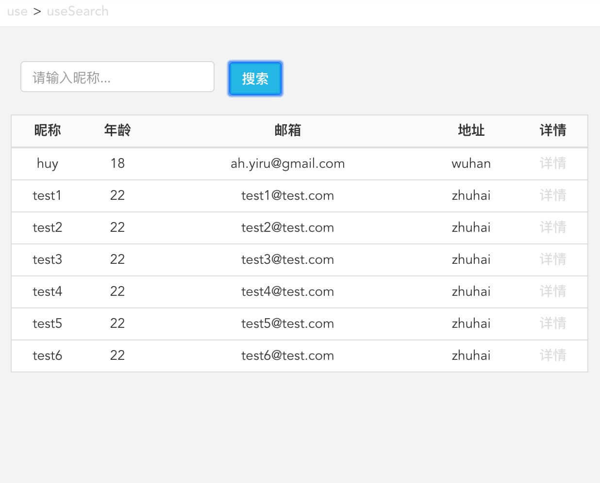

## useSearch

用于处理数据过滤，包含列表、树的搜索过滤。

### useSearch 使用示例

    const List=()=>{
      const result=fetchList.read().data;
      const [data,setData]=useSearch(result);
      const [keywords,setKeywords]=useState('');
      const table=data?data:result;
      return 

        

          
<input className="input" onChange={e=>setKeywords(e.target.value)} value={keywords} placeholder="请输入昵称..." />

          <button className="ybtn ybtn-info" onClick={()=>setData(result,keywords)}>搜索</button>
        

        {
          result?.length?
            <table className="ytable">
              <thead>
                <tr>
                  {
                    columns.map(v=><th key={v.key}>{v.text}</th>)
                  }
                </tr>
              </thead>
              <tbody>
                {
                  table.map(v=><tr key={v.id}>
                    {columns.map(sv=><td key={`${v.id}-${sv.key}`}>{v[sv.key]||<Link to={`/user/${v.id}`}>{sv.text}</Link>}</td>)}
                  </tr>)
                }
              </tbody>
            </table>:
            
empty

        }
      
;
    };

#### 使用说明

    const [list,setList]= useSearch;

- list：过滤后的新数据
- setList：过滤数据

#### setList(data,keywords,fileds,exact)

- data：数据列表或树
- keyword：搜索的关键字
- fileds：搜索的字段，为一字符串数组。如：['name','age']搜索字段`name`、`age`。默认`name`。
- exact：模糊匹配还是精确匹配，默认模糊匹配。

### 实现方式

#### filter

arr.filter();

#### 树形数据处理

如果子级有匹配到，则返回其所有父节点。

    getMatched=fn=>(arr,childKey='children')=>{ ... }

#### 使用

通过函数组合，得到 filterList 函数。

    filterList=(data,keyword,fields='name',childKey='children')=>getMatched((list,matchedItem)=>unique([...filter(list,keyword,fields),...matchedItem]))(data,childKey);

    const setList=useCallback((...args)=>{
      const newList=filterList(...args);
      setState(newList);
    },[]);
