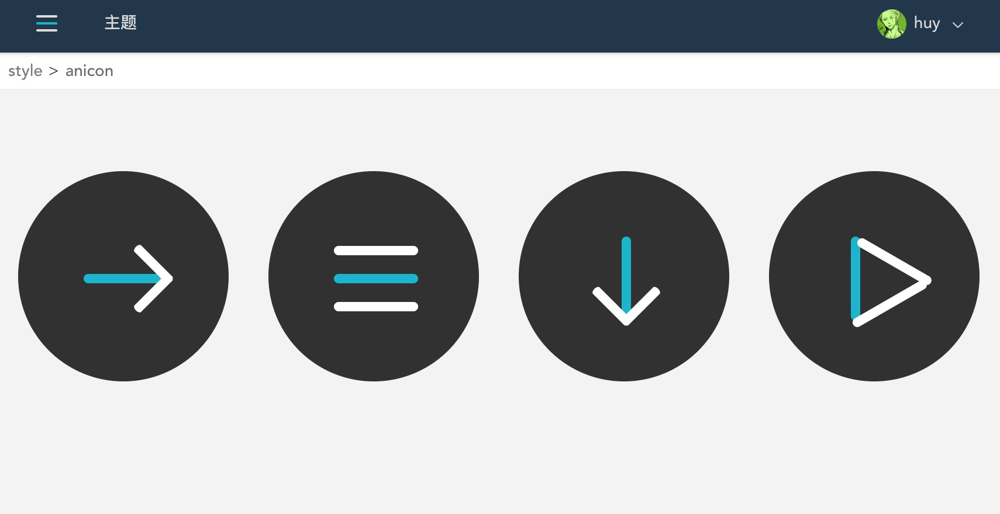

## css实现简单的动态图标

css3 提供了animation、transition的动画属性，能给页面添加一些动效，增强交互体验。

我们的网站上经常会使用到一些图标，如上下左右指示、关闭、播放、停止等，我们可以使用css来绘制这些图标，添加动效增强体验效果。

抛砖引入，我来用transition来实现这几个带动效的图标。

这些图标都是比较简单的线条，我们可以先画三条线。

### 画条线

可以借助伪元素来实现，避免不必要标签。

	.line{
	  width:18px;
	  height:2px;
	  display:inline-block;
	  left:50%;
	  top:50%;
	  transform:translateX(-50%) translateY(-50%);
	  transition:transform .3s,background-color .3s;
	  &::before,&::after{
	    content:'';
	    width:100%;
	    height:100%;
	    top:0;
	    left:0;
	    background-color:currentColor;
	    transition:transform .3s;
	  }
	  &::before{
	    transform:translateY(-6px);
	  }
	  &::after{
	    transform:translateY(6px);
	  }
	}

### 添加动效

#### 关闭图标 ❌

将两边线条旋转45度，中间的隐藏。

	.close{
	  background-color:rgba(255,255,255,0);
	  &::before{
	    transform:rotate(45deg);
	  }
	  &::after{
	    transform:rotate(-45deg);
	  }
	}

#### 右指向图标 ➡️

将两边线条旋转45度，移至最右边，并缩小一半。

	.right{
	  &::before{
	    transform:translateX(5px) translateY(-4px) rotate(45deg) scaleX(.5);
	  }
	  &::after{
	    transform:translateX(5px) translateY(4px) rotate(-45deg) scaleX(.5);
	  }
	}

#### 下指向图标 ⬇️

将两边线条旋转45度，移至最右边，并缩小一半。中间线条旋转90度。

	.bottom{
	  transform:translateX(-50%) translateY(-50%) rotate(-90deg);
	  &::before{
	    transform:translateX(-5px) translateY(-4px) rotate(-45deg) scaleX(.5);
	  }
	  &::after{
	    transform:translateX(-5px) translateY(4px) rotate(45deg) scaleX(.5);
	  }
	}

#### 播放、停止图标

播放状态：将两边线条旋转90度，中间线条隐藏。

停止状态：显示中间线条并移至左边，移动旋转两边的线条，组成一个三角形。

	.play{
	  transform:translateX(-50%) translateY(-50%) rotate(-90deg);
	  background-color:rgba(0,0,0,0);
	  &::before{
	    transform-origin:0 0;
	  }
	  &::after{
	    transform-origin:100% 100%;
	  }
	  &.pause{
	    background-color:currentColor;
	    transform:translateX(-75%) translateY(-50%) rotate(-90deg);
	    &::before{
	      transform:rotate(60deg);
	    }
	    &::after{
	      transform:rotate(-60deg);
	    }
	  }
	}

